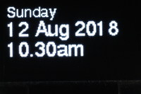
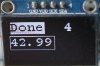
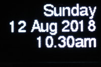
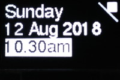
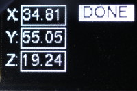

# Writer and Cwriter classes

These classes facilitate rendering Python font files to displays where the
display driver is subclassed from the `framebuf` class. Examples are:

 * The official [SSD1306 driver](https://github.com/micropython/micropython/blob/master/drivers/display/ssd1306.py).
 * The [PCD8544/Nokia 5110](https://github.com/mcauser/micropython-pcd8544.git).
 * The [Adafruit 0.96 inch color OLED](https://www.adafruit.com/product/684)
 with [this driver](https://github.com/peterhinch/micropython-nano-gui/tree/master/drivers/ssd1331).
 * The [Adafruit 1.5 inch color OLED](https://www.adafruit.com/product/1431) and
 the [Adafruit 1.27 inch color OLED](https://www.adafruit.com/product/1673) with
 [this driver](https://github.com/peterhinch/micropython-nano-gui/blob/master/drivers/ssd1351/ssd1351.py)
 for STM32 (Pyboards etc) or [this one](https://github.com/peterhinch/micropython-nano-gui/blob/master/drivers/ssd1351/ssd1351_generic.py)
 for other targets.
 * The [HX1230 96x68 LCD](https://github.com/mcauser/micropython-hx1230.git).
 * A driver for Sharp ultra low power consumption monochrome displays such as
 [2.7 inch 400x240 pixels](https://www.adafruit.com/product/4694)
 is [here](https://github.com/peterhinch/micropython-nano-gui/tree/master/drivers/sharp).
 * Drivers for Adafruit ST7735R based TFT's: 
 [1.8 inch](https://www.adafruit.com/product/358) and
 [1.44 inch](https://www.adafruit.com/product/2088) are
 [here](https://github.com/peterhinch/micropython-nano-gui/tree/master/drivers/st7735r).
 * Drivers for ePaper displays documented
 [here](https://github.com/peterhinch/micropython-nano-gui/blob/master/DRIVERS.md#7-epaper-displays)

Basic support is for scrolling text display using multiple fonts. The
[nanogui](https://github.com/peterhinch/micropython-nano-gui.git) module has
optional extensions for user interface objects displayed at arbitrary locations
on screen.

Example code and images are for 128*64 SSD1306 OLED displays.

  
Scrolling text, multiple fonts.

  
A field containing variable length text with a border.

  
Right justified text.

  
Mixed text and graphics.

  
Labels and Fields (from nanogui.py).

# Contents

 1. [Introduction](./WRITER.md#1-introduction)  
  1.1 [Release notes](./WRITER.md#11-release-notes)  
  1.2 [Hardware](./WRITER.md#12-hardware)  
  1.3 [Files](./WRITER.md#13-files)  
  1.4 [Fonts](./WRITER.md#14-fonts)  
 2. [Writer and CWriter classes](./WRITER.md#2-writer-and-cwriter-classes)  
  2.1 [The Writer class](./WRITER.md#21-the-writer-class) For monochrome displays.  
   &nbsp;&nbsp;&nbsp;&nbsp;&nbsp;2.1.1 [Static Method](./WRITER.md#211-static-method)  
   &nbsp;&nbsp;&nbsp;&nbsp;&nbsp;2.1.2.[Constructor](./WRITER.md#212-constructor)  
   &nbsp;&nbsp;&nbsp;&nbsp;&nbsp;2.1.3 [Methods](./WRITER.md#213-methods)  
  2.2 [The CWriter class](./WRITER.md#22-the-cwriter-class) For colour displays.  
   &nbsp;&nbsp;&nbsp;&nbsp;&nbsp;2.2.1 [Constructor](./WRITER.md#221-constructor)  
   &nbsp;&nbsp;&nbsp;&nbsp;&nbsp;2.2.2 [Methods](./WRITER.md#222-methods)  
   &nbsp;&nbsp;&nbsp;&nbsp;&nbsp;2.2.3 [A performance boost](./WRITER.md#223-a-performance-boost)  
 3. [Notes](./WRITER.md#3-notes)

###### [Main README](../README.md)

# 1. Introduction

The module provides a `Writer` class for rendering bitmapped monochrome fonts
created by `font_to_py.py`. The `CWriter` class extends this to support color
rendering. Rendering is to a `FrameBuffer` instance, e.g. to a display whose
driver is subclassed from a `FrameBuffer`.

The module has the following features:  
 * Genarality: capable of working with any `framebuf` derived driver.
 * Multiple display operation.
 * Text display of fixed and variable pitch fonts with wrapping and vertical
 scrolling.
 * Wrap/clip options: clip, character wrap or word wrap.
 * Tab support.
 * String metrics to enable right or centre justification.
 * Inverse (background color on foreground color) display.

Note that these changes have significantly increased code size. On the ESP8266
it is likely that `writer.py` will need to be frozen as bytecode. The original
very simple version still exists as `writer_minimal.py`.

## 1.1 Release Notes

V0.4.0 Jan 2021  
Improved handling of the `col_clip` and `wrap` options. Improved accuracy
avoids needless word wrapping. The clip option now displays as much of the last
visible glyph as possible: formerly a glyph which would not fit in its entirety
was discarded.

The inverted display option has been withdrawn. It added significant code size
and was not an optimal solution. Display inversion should be done at the device
driver level. Such a solution works for graphics objects and GUI widgets, while
the old option only affected rendered text.

## 1.2 Hardware

Tests and demos assume a 128*64 SSD1306 OLED display connected via I2C or SPI.
Wiring is specified in `ssd1306_setup.py`. Edit this to use a different bus or
for a non-Pyboard target.

## 1.3 Files

 1. `writer.py` Supports `Writer` and `CWriter` classes.
 2. `ssd1306_setup.py` Hardware initialisation for SSD1306. Requires the
 official [SSD1306 driver](https://github.com/micropython/micropython/blob/master/drivers/display/ssd1306.py).
 3. `writer_demo.py` Demo using a 128*64 SSD1306 OLED display. Import to see
 usage information.
 4. `writer_tests.py` Test/demo scripts. Import to see usage information.
 5. `writer_minimal.py` A minimal version for highly resource constrained
 devices.
 6. `framebuf_utils.framebuf_utils.mpy` A means of improving rendering speed
 on color displays. Discussed [in 2.2.3](./WRITER.md#223-a-performance-boost)  

Sample fonts:
 1. `freesans20.py` Variable pitch font file.
 2. `courier20.py` Fixed pitch font file.
 3. `font10.py` Smaller variable pitch fonts.
 4. `font6.py`

## 1.4 Fonts

Python font files should be created using `font-to-py.py` using horizontal
mapping (`-x` option). The `-r` option is not required. If RAM is critical
fonts may be frozen as bytecode reducing the RAM impact of each font to about
340 bytes. This is highly recommended.

###### [Contents](./WRITER.md#contents)

# 2. Writer and CWriter classes

The `Writer` class provides fast rendering to monochrome displays using bit
blitting.

The `CWriter` class is a subclass of `Writer` to support color displays. Owing
to limitations in the `frmebuf.blit` method the `CWriter` class renders glyphs
one pixel at a time; rendering is therefore slower than the `Writer` class. A
substantial improvement is possible. See [2.2.3](./WRITER.md#223-a-performance-boost).

Multiple screens are supported. On any screen multiple `Writer` or `CWriter`
instances may be used, each using a different font. A class variable holds the
state of each screen to ensure that the insertion point is managed across
multiple instances/fonts.

###### [Contents](./WRITER.md#contents)

## 2.1 The Writer class

This class facilitates rendering characters from Python font files to a device,
assuming the device has a driver subclassed from `framebuf`. It supports three
ways of handling text which would overflow the display: clipping, character
wrapping and simple word wrapping.

It handles newline and tab characters, black-on-white inversion, and field
blanking to enable variable length contents to be updated at a fixed location.

Typical use with an SSD1306 display and the official driver is as follows:

```python
from ssd1306_setup import WIDTH, HEIGHT, setup
from writer import Writer
import freesans20  # Font to use

use_spi=False  # Tested with a 128*64 I2C connected SSD1306 display
ssd = setup(use_spi)  # Instantiate display: must inherit from framebuf
# Demo drawing geometric shpes
rhs = WIDTH -1
ssd.line(rhs - 20, 0, rhs, 20, 1)  # Demo underlying framebuf methods
square_side = 10
ssd.fill_rect(rhs - square_side, 0, square_side, square_side, 1)
# Instantiate a writer for a specific font
wri = Writer(ssd, freesans20)  # verbose = False to suppress console output
Writer.set_textpos(ssd, 0, 0)  # In case a previous test has altered this
wri.printstring('Sunday\n12 Aug 2018\n10.30am')
ssd.show()
```

The file `writer_demo.py` illustrates the use of font files with a 128*64
SSD1306 OLED display and the official
[SSD1306 driver](https://github.com/micropython/micropython/blob/master/drivers/display/ssd1306.py).

### 2.1.1 Static Method

The `Writer` class exposes the following static method:

 1. `set_textpos(device, row=None, col=None)`. The `device` is the display
 instance. This method determines where on screen subsequent text is to be
 rendered. The initial value is (0, 0) - the top left  corner. Arguments are in
 pixels with positive values representing down and right respectively. The
 insertion point defines the top left hand corner of the next character to be
 output.
 
 Where `None` is passed, the setting is left unchanged.  
 Return: `row`, `col` current settings.

 The insertion point applies to all `Writer` instances having the same device.
 The insertion point on a given screen is maintained regardless of the font in
 use.

### 2.1.2 Constructor

This takes the following args:
 1. `device` The hardware device driver instance for the screen in use.
 2. `font` A Python font instance.
 3. `verbose=True` If `True` the constructor emits console printout.

### 2.1.3 Methods

 1. `printstring(string, invert=False)`. Renders the string at the current
 insertion point. Newline and Tab  characters are honoured. If `invert` is
 `True` the text is output with foreground and background colors transposed.
 2. `height()`  Returns the font height in pixels.
 3. `stringlen(string, oh=False)` Returns the length of a string in pixels.
 Appications can use this for right or centre justification.  
 The `oh` arg is for internal use. If set, the method returns a `bool`, `True`
 if the string would overhang the display edge if rendered at the current
 insertion point.
 4. `set_clip(row_clip=None, col_clip=None, wrap=None)`. If `row_clip` and/or
 `col_clip` are `True`, characters will be clipped if they extend beyond the
 boundaries of  the physical display. If `col_clip` is `False` characters will
 wrap onto the next line. If `row_clip` is `False` the display will, where
 necessary,  scroll up to ensure the line is rendered. If `wrap` is `True`
 word-wrapping will be performed, assuming words are separated by spaces.  
 If any arg is `None`, that value will be left unchanged.  
 Returns the current values of `row_clip`, `col_clip` and `wrap`.
 5. `tabsize(value=None)`. If `value` is an integer sets the tab size. Returns
 the current tab size (initial default is 4). Tabs only work properly with
 fixed pitch fonts.

###### [Contents](./WRITER.md#contents)

## 2.2 The CWriter class

This extends the `Writer` class by adding support for color displays. A color
value is an integer whose interpretation is dependent on the display hardware
and device driver. The Python font file uses single bit pixels. On a color
screen these are rendered using foreground and background colors.

### 2.2.1 Constructor

This takes the following args:  
 1. `device` The hardware device driver instance for the screen in use.
 2. `font` A Python font instance.
 3. `fgcolor=None` Foreground color. If `None` a monochrome display is assumed.
 4. `bgcolor=None` Background color. If `None` a monochrome display is assumed.
 5. `verbose=True` If `True` the constructor emits console printout.

### 2.2.2 Methods

All methods of the base class are supported. Additional method:  
 1. `setcolor(fgcolor=None, bgcolor=None)`. Sets the foreground and background
 colors. If one is `None` that value is left unchanged. If both are `None` the
 constructor defaults are restored. Constructor defaults are 1 and 0
 for monochrome displays (`Writer`). Returns foreground and background color
 values.

The `printstring` method works as per the base class except that the string is
rendered in foreground color on background color (or reversed if `invert` is
`True`).

### 2.2.3 A performance boost

Rendering performance of the `Cwriter` class is slow: owing to limitations in
the `framebuf.blit` method the class renders glyphs one pixel at a time. There
is a way to improve performance. It was developed by Jim Mussared (@jimmo) and
consists of a native C module.

On import, `writer.py` attempts to import a module `framebuf_utils`. If this
succeeds, glyph rendering will be substantially faster. If the file is not
present the class will work using normal rendering. If the file exists but was
compiled for a different architecture a warning message will be printed. This
is a harmless advisory - the code will run using normal rendering.

The directory `framebuf_utils` contains the source file, the makefile and a
version of `framebuf_utils.mpy` for `armv7m` architecture (e.g. Pyboards).
ESP32 users with access to the development toolchain should change `Makefile`
to specify the `xtensawin` arch and rebuild.

It is suggested that moving the appropriate `framebuf_utils.mpy` to the target
is only done once the basic operation of an application has been verified.

The module has a `fast_mode` variable which is set `True` on import if the mode
was successfully engaged. User code should treat this as read-only.

# 3. Notes

Possible future enhancements:
 1. General rendering to a rectangular area. This may be problematic as the
 `framebuf`  scroll method is only capable of scrolling the entire buffer.
 2. Extend word wrapping to cases where words are separated by tabs or hyphens.
 3. An asynchronous version.

###### [Contents](./WRITER.md#contents)
